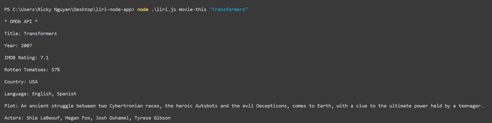

Liri.js is a node.js/CLI application that implements the Spotify API, Bandsintown API and OMDb API. You can search for song information, touring artists/bands and movie information with liri.js. See the below screenshots for syntax and usage.

Dependencies:

You will need to create a .env file with your own API keys for liri.js to function properly.

You will also need to install the following node_modules.

npm i node-spotify-api
npm i dotenv
npm i moment
npm i request
npm i fs

APIS

Spotify Setup

OMDB Setup

BandsInTown Setup

FS Setup

